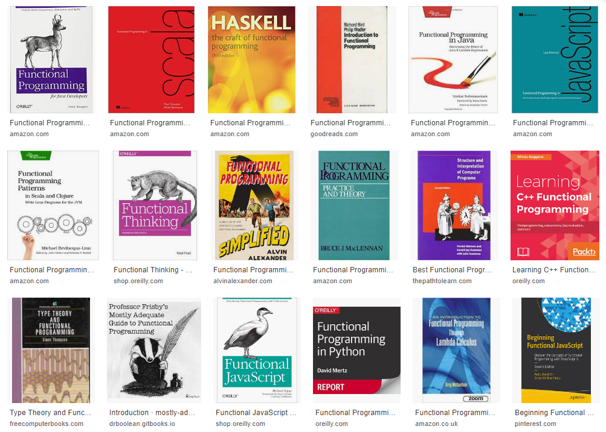
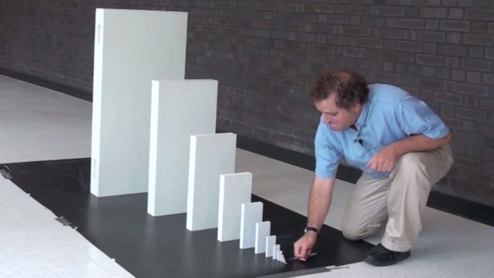
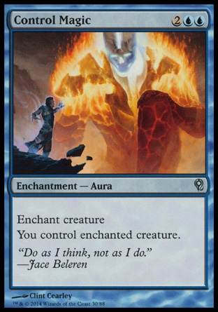

.. title:: The Elm Architecture for Android

This is the source for the deck "The Elm Architecture for Android"
It is meant to be viewed through the `Hovercraft!`_ slides engine

.. _Hovercraft!:  https://github.com/regebro/hovercraft>

.. footer::
    
    "TEA для Android приложений", @themishkun, Southdevfest, 2019 |devfest| 

:data-transition-duration: 500
:css: gdg-tea.css

----

The Elm Architecture 
====================
Функциональный стиль |glasses| для ваших Android приложений

.. note::

    Сегодня я вам расскажу, как можно использовать функциональное программирование, чтобы сделать разработку Android приложений
    приятнее, предсказуемее и проще, чем это принято в индустрии.
    Мы обсудим различные важные концепции, такие как
        
        - что такое функциональный стиль
        - какие мы можем выделить основополагающие черты
        - как это может помочь в проектировании приложения
    
    Также я дам вам рецепт того, как внедрить TEA в ваше приложение

----

Функциональный стиль
====================
Стиль построения программ, который рассматривает программу как *вычисление математической функции* и *избегает побочных эффектов* и *изменения состояния*

.. class:: align-right
    
    *-- Wikipedia*

.. note:: 

    Когда начинаешь программировать в функциональном стиле и на себе ощущать простоту идей,
    невольно задумываешься, 
    
    - "почему вокруг так мало функциональщины?" 
    - "почему люди считают, что функциональное программирование - это такой способ получить PhD в Computer Science, а решать прикладные задачи лучше в другой парадигме"

    А потом я открыл как-то страничку на википедии и до меня дошло, в чём дело - если прочесть определение
    функционального стиля - то всё становится понятно - вот тебе 
    
    - "математической"- явно для зубрил, ладно, посмотрим чё там дают взамен
    - "избегает побочных эффектов и изменения состояния" - и если ты профессиональный программист - ты сразу такой 

----

:class: big-title
:class: big-subtitle

:data-scale: 5
:data-rotate: 0
:data-x: r3000

ЧТО?
====
Но в этом же вся суть!
----------------------

.. note:: 

    Наши программы сделаны для того чтобы иметь эффект на окружающий мир. Какой стартап не возьми - у всех в целях
    "мы хотим изменить мир к лучшему!" 
    Но как вы собираетесь изменять мир к лучшему с функциональном программированием, если у него в определении указано,
    что фишка в том, чтобы ничего не менять. Сразу перед глазами всплывает программист - дзен - буддист, которые все таски
    закрывает как "не будет исправлено", потому что код прекрасен сам по себе и делать ничего полезного ему не нужно.

----

:data-scale: 1
:data-rotate: 0
:data-x: r5000

:class: overflow

.. note:: 

    И тем не менее, функциональное программирование всё же на слуху, посмотрите только на количество книг,
    рассказывающих о приёмах функционального программирования на разных языках

    И если на JavaScript, Python, Scala ещё можно представить функциональщину,
    то тут есть ещё Java, Objective-C и C++.
    
    И если посмотреть например, на Manning, они то начиная с 2016 года они выпускают по нескольку
    книг по фп в год!
    
----

:data-x: r1600

ФП на самом деле уже здесь
==========================

- функции второго порядка
- map, filter, fold
- иммутабельные структуры данных

.. note::

    На самом деле, фп уже здесь 

    Всё таки в нём есть множество идей, которые уже давно вошли в мейнстрим языки.
    Сейчас жизнь мобильного дева сложно представить без любой из этих вещей.

    Но мы по прежнему используем эти идеи только на маленьких масштабах
    Когда же возникает мысль "хм, это фп вроде неплохо работает - а почему бы не написать всё приложение с его использованием?"
    Мы сразу её отметаем, вспоминая об определении из википедии.
    Мы ведь не можем делать программу на основе концепции, вся суть которой в том чтобы избегать возможности что-либо делать? 

----

Функциональный стиль
====================

Стиль построения программ, в котором код разделяют на три категории

1. Данные
2. Вычисления
3. Действия

.. note::

    Всем, кто раньше сталкивался с фп и у кого сформировалось мнение, что оно того не стоит, предлагаю перефразировать
    определение функционального стиля

    В ФП можно прийти разными путями, и среди фп сообщества есть свои холивары по поводу того,
    каких программистов можно называть функциональщиками, каких - нет. И вообще, что есть Торт, а что - нет
    это вечный вопрос.

    Но по моим ощущениям в чём то практики фп согласны - это в том, что функциональный стиль - это про то, как смотреть
    на код, который мы пишем

    Давайте посмотрим на эти три категории внимательнее

----

Данные
======

Факты о моделируемой системе

.. note::

    Нам, программистам, не особо стоит объяснять что такое данные, но повторюсь:
    
    Зачастую данные можно представить в виде key-value или списков. Мы привыкли,
    что "данные" обычно пользовательские, но они на самом деле повсюду
    и могут быть частью конфигурации либо частью логики

    данными можно назвать как прилепленный на холодильник список покупок
    так и цвет кнопки, который вы передаёте в метод отрисовки GUI фреймворка

----

Данные сериализуются
====================

.. dot:: 
    :width: 600 

    digraph {
        nodesep = 1.5;
        { rank=same Data1 Data2}
        Data1 [label="Data"];
        Data2 [label="Data'"];
        subgraph cluster_0 {
            label = "Хранилище"
            JSON [shape=cylinder];
        }
        Data1 -> JSON
        JSON -> Data2
    }

.. note::

    Продолжаю капитанить: данные можно сериализовать!

    Но, на самом деле, если хорошенько порефлексировать, то это замечательное свойство
    данных, которое, как мы потом посмотрим, остутствует у других категорий кода.
    Данные находятся **вне времени** - если их хранилище достаточно живучее и у нас есть 
    инструмент для их извлечения - мы можем хоть через 1000 лет за ними вернуть и с ними
    ничего не будет.

----

Данные - лучшая абстракция
==========================

- Открыты для интерпретации
- Бессмыслены сами по себе

.. note::

    Данные - лучший вид абстракции, они абсолютно открыты для интерпретации
    Это значит что одни и те же данные можно интерпретировать как угодно
    например, можно список покупок использовать для того чтобы не забыть ничего в магазине
    а можно с помощью него же планировать бюджет

    Но при этом, как и положено высочайшему уровню абстракции, данные бессмыслены
    сами по себе. Даже для того чтобы извлечь какой-то смысл из списка покупок,
    ваш мозг включает встроенный в него интерпретатор и производить из него другие
    данные, другие смыслы.

----

Вычисления
==========

Операции, результат которых содержится только в *выходном* значении и зависит только от *входных* данных

----

Вычисления самостоятельны
=========================

- Изолированы от времени/окружения
- Легко понимать/тестировать

----

Кубики |lego|
=============

- Легко композировать
- Мы не знаем, что у них внутри

.. dot::
    :height: 200

    digraph {
        nodesep=1
        edge[arrowhead=vee arrowsize=.5]
        r1 [label="B" shape="plain"];
        t1 [label="A" shape="plain"];
        q1 [label="C" shape="plain"];
        { rank=same; t1;  q1; }
        t1 -> r1 [label="f"];
        r1 -> q1 [label="g"];
        t1 -> q1 [label="h" style=dashed];
    }

----

Действия
========

Вычисления, которые зависят от времени

----

- Зависят от времени и среды
- Сложно тестировать

----

:class: big-subtitle
:class: start-h2

Распространяются вверх по дереву вызова
=======================================

----

:class: big-subtitle
:class: start-h2

Приносят деньги
===============

----

:class: big-title
:class: big-subtitle

Основной принцип функционального дизайна

1. Данные
=========
2. Вычисления
---------------
3. Действия
...........

.. note::

    После того, как я вам представил все три категории, можно вывести основной, на мой взгляд, принцип
    ФД. Стараемся использовать в коде как можно больше данных и вычислений. И контролируем, где и когда мы выполняем действия
    так как они единственные зависят от времени.

----

:class: overflow

Model-View-Presenter
====================

.. code:: kotlin

    fun onClick(offerId: String) { // Действие
        api.getOffer(offerId) // Действие
            .doOnSubscribe { view.showLoading() } // Действие
            .subscribe { data ->
                view.hideLoading() // Действие
                view.display(data) // Действие
            }
    }

.. note::

    Если мы вооружимся этим подходом и взглянем на классический MVP
    принятый в андроиде с точки зрения функционального дизайна - о ужас!
    Тут сплошь и рядом одни действия! Не удивительно, что типичный конструктор
    презентера требует десятков моков в тестах

----

:class: overflow

Model-View-Intent
=================

.. code:: kotlin

    // Logic.kt

    fun accept(state: State, msg: Msg) = when(msg) {
        is OnOfferClick -> if (!state.isLoading) { 
                api.getOffer(msg.offerId) // Действие
                   .startWith { SetLoading }
                   .map { UpdateWithData(it) }
            } else {
                Observable.just(SetLoading)
            }
    }

    // Reducer.kt

    fun state(state: State, update: Update): State = when(update) { // Вычисления
        is UpdateWithData -> state.copy(data = update.data, loading = false)
        is SetLoading -> state.copy(loading = true)
    }

----

MVI
===

.. dot::

    digraph {
        rankdir = "LR"
        edge[arrowhead=vee arrowsize=.5]
        node[shape=box]
        UI -> Logic [label="Intent"]
        Update [shape=plain]
        { rank=same Reducer Logic Update }
        Logic -> Update [style=none arrowhead=none]
        Update -> Reducer
        Reducer -> UI [label="State'"] 
        Reducer -> Reducer:s [label="State"]
        Logic -> UI [label="Effect"]
        API [shape=cylinder style=dashed]
        Logic -> API
    }

----

:class: overflow

The Elm-ish Architecture
========================

.. code:: kotlin

    // Reducer.kt

    fun update(state: State, msg: Msg): Pair<State, Cmd?> = when(msg) {
        is OnOfferClick -> {
            val cmd = if (!state.loading) Load(msg.offerId) else null
            state.copy(loading = true) to cmd
        }
        is NewDataArrived -> state.copy(data = update.data, loading = false) to null
    }

----

.. code:: kotlin

    // EffectHandler.kt

    class CommandInterpreter(api: Api) {
        fun interpret(
            cmd: Command, 
            listener: (Msg) -> Unit
        ) = when(cmd) {
            is Load -> {
                val model = api.getOffer(eff.offerId)
                listener(NewDataArrived(model))
            }
        }
    }

----

TEA
===

.. dot::

    digraph {
        rankdir = "LR"
        edge[arrowhead=vee arrowsize=.5]
        node[shape=box]
        nodesep=0.1
        UI -> Reducer [label="Msg"]
        Reducer -> UI [label="State' \nCmd"]
        Reducer [shape=hexagon]
        Cmd [label="Command\nInterpreter"]
        Cmd -> API
        Reducer -> Cmd [label="Cmd"]
        Cmd -> Reducer [label="Msg"]
        API [shape=cylinder style=dashed]
        Cmd2 [label="Command\nInterpreter" style=dashed]
        Cmd3 [label="Command\nInterpreter" style=dashed]
        Cmd2 -> Service
        Cmd3 -> Service2
        Cmd -> Cmd2:s [style=invis]
        Cmd2 -> Cmd3:s [style=invis]
        {rank=same Cmd  Cmd2 Cmd3 }
        Service [shape=cylinder style=dashed]
        Service2 [shape=cylinder style=dashed]
    }

----

:class: flex

.. raw:: html
    
    

        <h1>Профит</h1>
        
Тотальный контроль над эффектами и их исполнением

    

.. note::

    Так и зачем всё это? Для того чтобы достичь тотального контроля над эффектами.
    Вам больше неинтересно, какой у вас фреймворк для асинхронной работы.
    RxJava, корутины, просто треды - практически все они выглядят одинаково.
    
    Вам больше не нужно писать моки в тестах - действия вашей системы и так являются данными,
    которые можно просто ассертать.

    Вы можете одной строчкой встроить логирование всего происходящего для того чтобы выловить баг.

----

:class: flex
:class: big-title
:class: big-subtitle

.. raw:: html

    

        <h1>1. Данные</h1>
        <h2>2. Вычисления</h2>
        <h3>3. Действия</h3>
    

.. container:: margin flex-align-center flex-direction

    @Mishkun

    .. image:: github_qr.png
        :height: 200

.. container:: margin flex-align-center flex-direction

    @lambda61

    .. image:: lambda_tg_qr.png
        :height: 200

.. note::

    И эти принципы лежат во многих функциональных библиотеках и фреймворках. В том числе и в основе
    The Elm Architecture, принятой в функциональном языке Elm, компилирующемся в JavaScript и
    позволяющем писать фронтенд в в красивом фп стиле.
